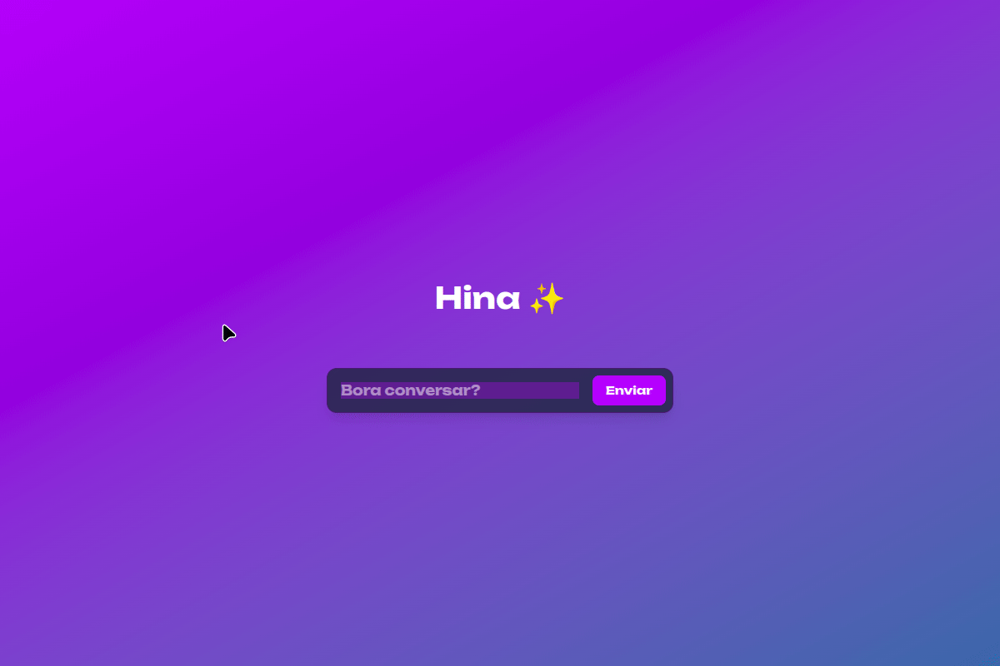

# 💬 Hina AI - Assistente Virtual Minimalista

Uma interface de chat minimalista, moderna e fluida integrada à API do Google Gemini, focada em alta performance, UX limpa e retenção de contexto.

---

## 🎯 Sobre o Projeto

A **Hina AI** foi criada com o objetivo de entregar uma experiência de conversação humanizada e acolhedora em uma interface inspirada na simplicidade do Google Gemini. 

Nesta versão refatorada, o foco principal foi a **Engenharia de Software e UX/UI**: eliminação de ruídos visuais, gerenciamento eficiente de memória de curto prazo (histórico stateless) e estruturação de rotas de API otimizadas no Next.js.

---

## ⚡ Diferenciais e Destaques Técnicos

- **Interface Minimalista & Responsiva:** Design focado no que importa (a conversa), sem distrações visuais e ajustado para telas mobile e desktop.
- **Gerenciamento de Histórico Stateless:** Manipulação de arrays (`.map()`, `.slice()`) no Server-Side para formatar a memória da conversa antes de enviar para o SDK da Gemini API.
- **System Prompt Personalizado:** Configuração avançada de diretrizes de personalidade (tom acolhedor, limitação de marcações indesejadas e resposta a Easter Eggs).
- **TypeScript Strict:** Código 100% tipado e sem o uso de `any`, garantindo maior confiabilidade e prevenção de bugs em tempo de compilação.

---

## 🛠️ Tecnologias Utilizadas

- **Frontend/Backend:** [Next.js](https://nextjs.org/) (App Router)
- **Linguagem:** [TypeScript](https://www.typescriptlang.org/)
- **Estilização:** [Tailwind CSS](https://tailwindcss.com/)
- **Inteligência Artificial:** [Google Gemini API](https://ai.google.dev/) (`@google/genai`)
- **Ícones:** [Lucide React](https://lucide.dev/)

---

## 🚀 Como Executar o Projeto Localmente

### 1. Clone o repositório

    git clone https://github.com/FelipeGdasilva/hina-assistente.git
    cd hina-assistente

### 2. Instale as dependências

    npm install

### 3. Configure as variáveis de ambiente

Crie um arquivo `.env.local` na raiz do projeto e adicione sua chave da API do Gemini:

    GEMINI_API_KEY=sua_chave_aqui

### 4. Inicie o servidor de desenvolvimento

    npm run dev

### 5. Acesse o projeto

Abra http://localhost:3000 no seu navegador para ver o resultado.

---

## 🧑‍💻 Desenvolvido por

Feito com dedicação por Felipe Gomes.
